# FarmHub - Connecting Farmers & Consumers

FarmHub is a Flutter-based cross-platform mobile application designed to eliminate middlemen in agriculture by directly connecting farmers and consumers. The app provides real-time inventory management, product listing, and a marketplace where consumers can browse, chat, and buy fresh produce straight from nearby farms.

## Features
 Firebase Authentication for login/signup
- Consumer and Farmer modes
- Farmer Dashboard for inventory and sales
- Consumer Marketplace for browsing and purchasing products
- Real-time data with Firebase Firestore
- Product images uploaded using Cloudinary
- Location-based farmer discovery
- Cart and Payment Integration

## 📸 Screenshots

### 🔐 Authentication Screens

| Consumer Login | Consumer Signup | Farmer Login | Farmer Signup |
|----------------|------------------|--------------|----------------|
| 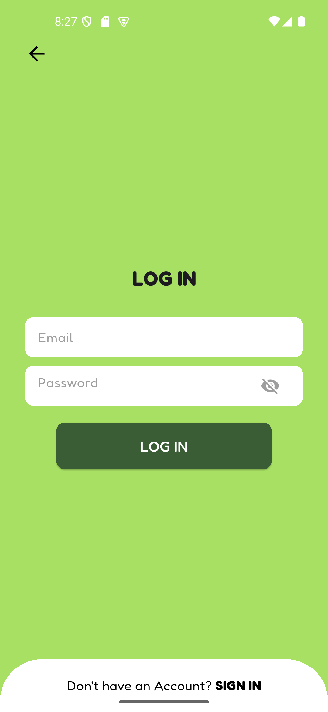 | 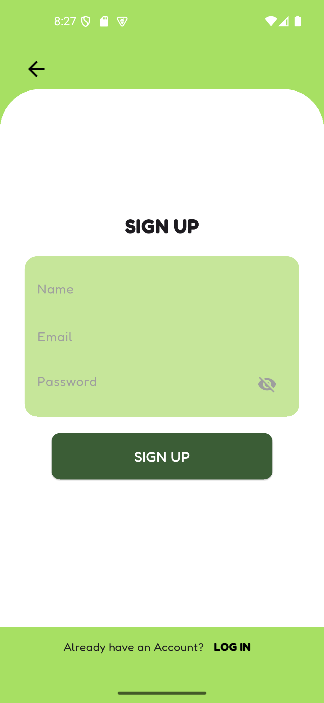 |  | 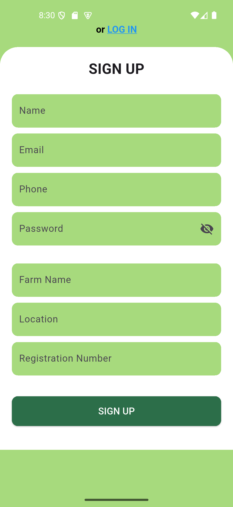 |

---

### 🧑‍🌾 Farmer Side Screens

| Dashboard | Inventory | Add Product | Profile |
|-----------|-----------|-------------|---------|
| 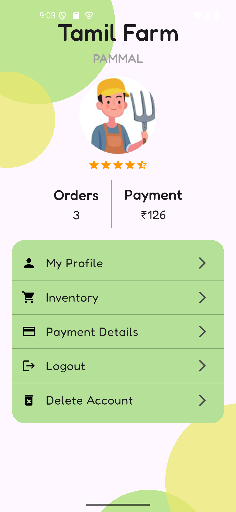 | 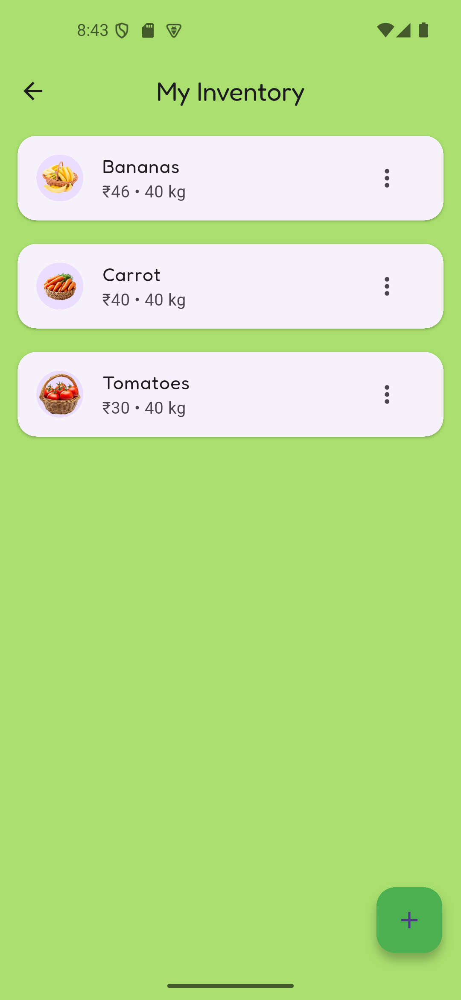 | 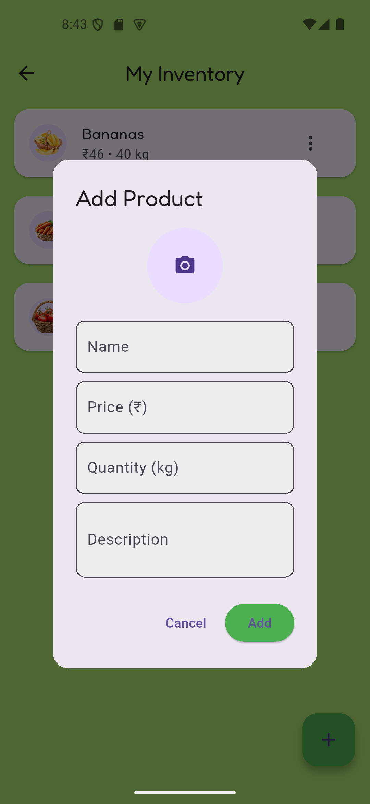 | 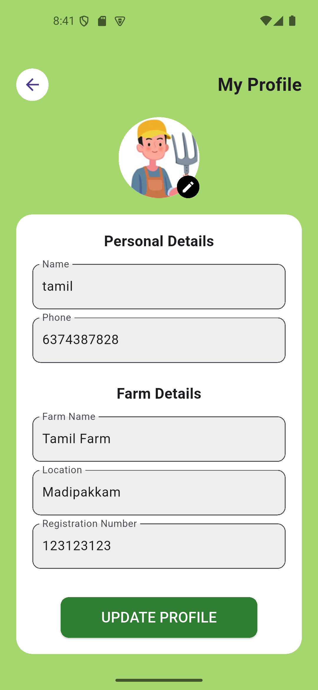 |

| Payment Details |
|-----------------|
| 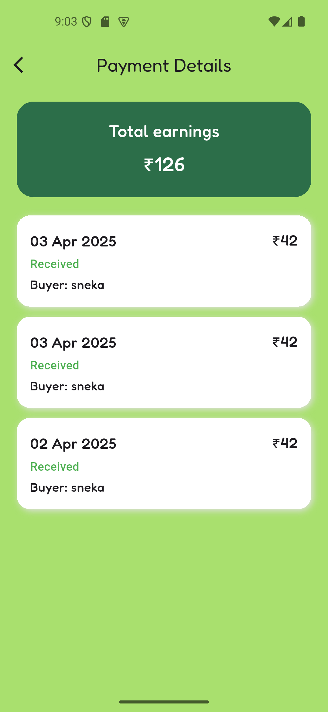 |

---

### 🛒 Consumer Side Screens

| Home Page | Marketplace | Cart | Checkout |
|-----------|-------------|------|----------|
| 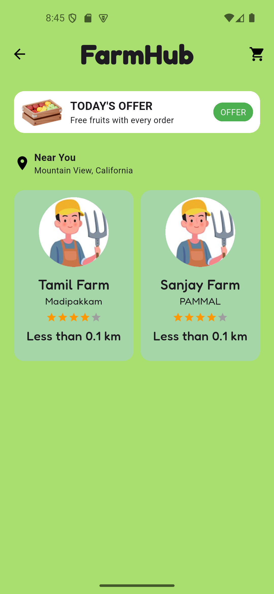 | 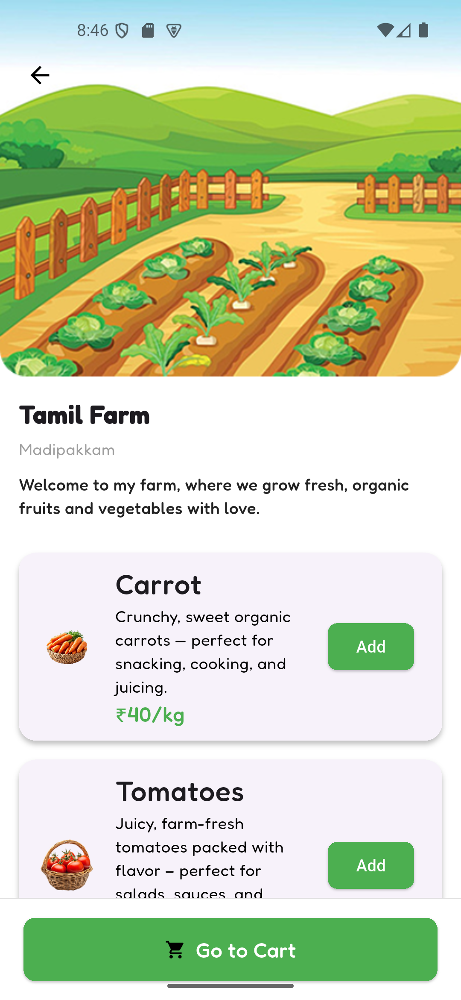 | 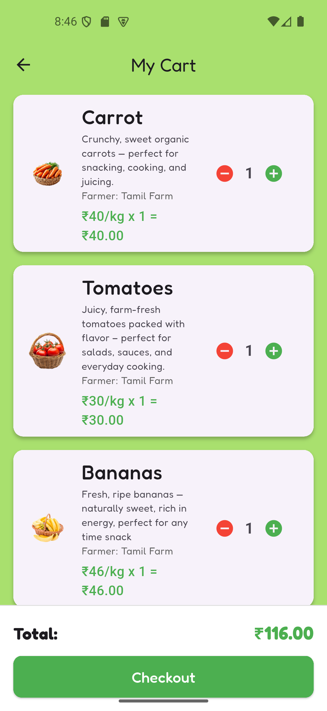 | 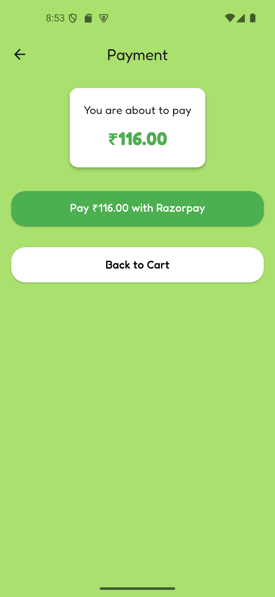 |

| Order Confirmation | Payment Details |
|--------------------|------------------|
| 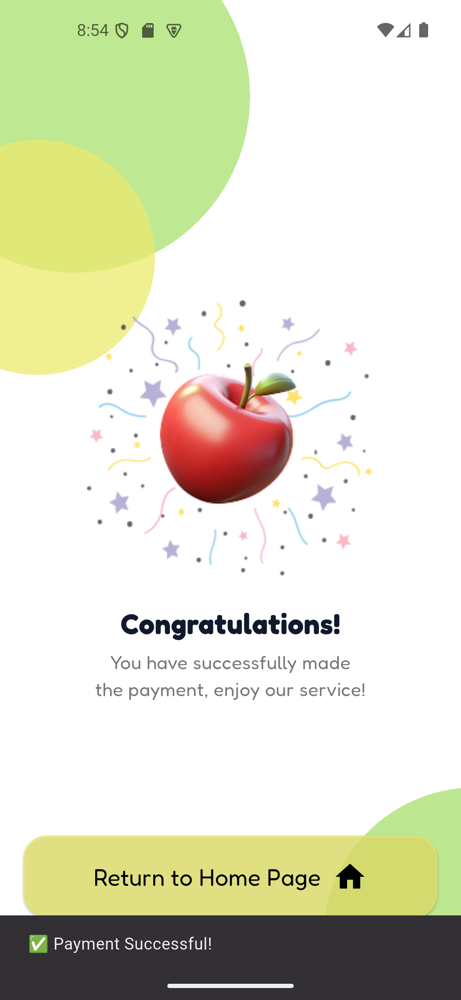 | 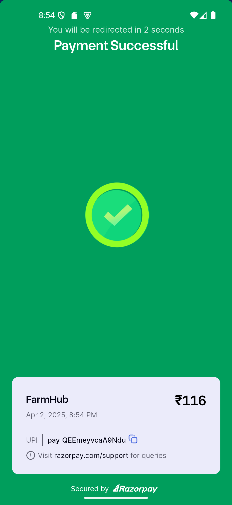 |

---

### 📍 Location Access

| Location Access Prompt |
|------------------------|
| 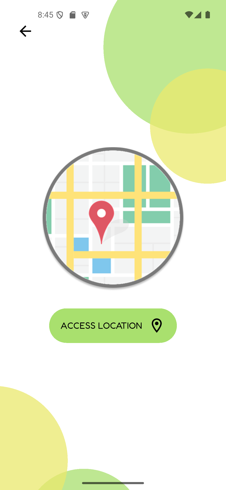 |


### Prerequisites

- Flutter SDK (>=3.0.0)
- Dart (>=2.17.0)
- Android Studio / VS Code
- Firebase Project
- Cloudinary Account (for image storage)

### Installation

1. Clone the repository:
```bash
git clone https://github.com/yourusername/farmhub.git
cd farmhub

Install dependencies:
flutter pub get

Set up Firebase:

Create a Firebase project at https://console.firebase.google.com/

Add Android/iOS apps to the Firebase project

Download google-services.json and place it in android/app/

Enable Firestore, Authentication, and Storage

Set up Cloudinary:

Sign up at https://cloudinary.com/

Note your cloud name, API key, and API secret

Use them in your image upload functions

Run the app:
flutter run

Folder Structure
lib/
├── main.dart
├── auth/               # Login and signup screens
├── dashboard/          # Farmer dashboard UI
├── marketplace/        # Consumer view and product listing
├── models/             # Data models
├── services/           # Firebase & Cloudinary services
├── widgets/            # Reusable components
└── utils/              # Constants, helpers

Dependencies:
firebase_auth
cloud_firestore
firebase_core
firebase_storage
provider
geolocator
image_picker
http

Firebase Collections (Structure)
users (stores user data, role: farmer/consumer)
products (stores items listed by farmers)
orders (tracks purchases)
carts (temporary cart data per consumer)
chats (consumer-farmer chat messages)

Contributing
Contributions are welcome! Please fork the repo and submit a pull request for any improvements or fixes.
